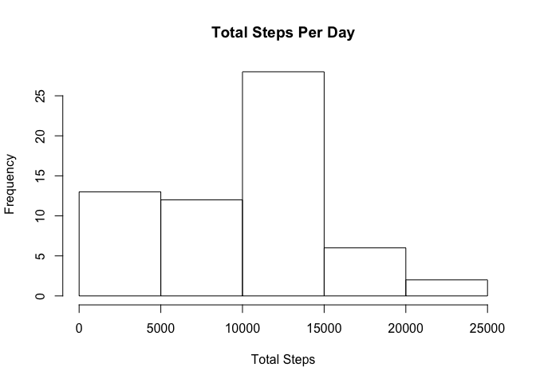
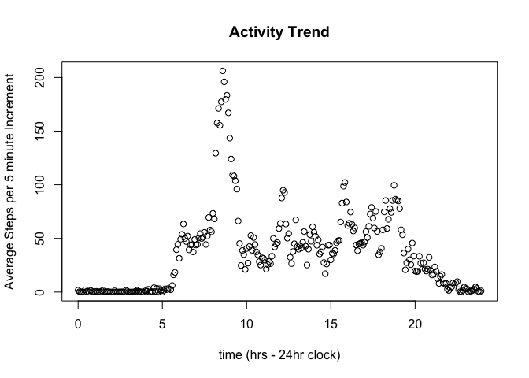
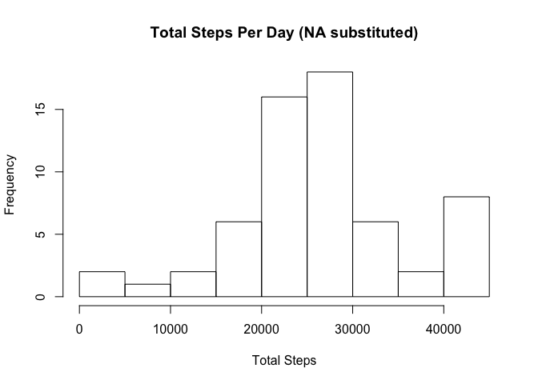
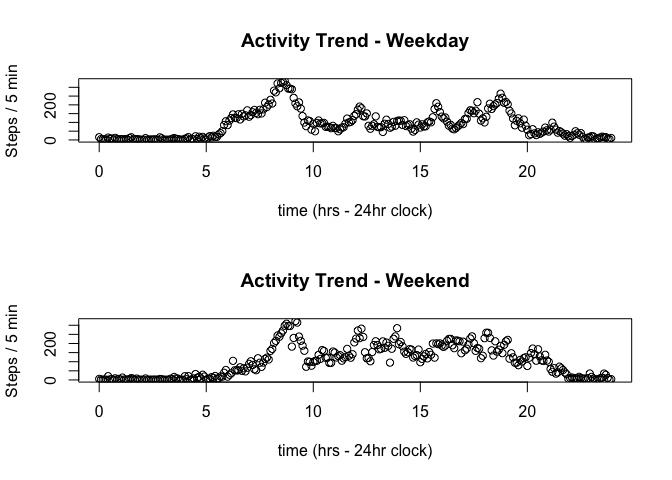

# Reproducible Research: Peer Assessment 1


## Loading and preprocessing the data
Find data file in local branch of repo, unzip file and read as 'dat'


```r
        datfile <- unzip("~/GitHub/RepData1/RepData_PeerAssessment1/activity.zip")
        dat <- read.csv("./activity.csv", stringsAsFactors = FALSE)
```

View file and make summary


```r
        head(dat)
```

```
##   steps       date interval
## 1    NA 2012-10-01        0
## 2    NA 2012-10-01        5
## 3    NA 2012-10-01       10
## 4    NA 2012-10-01       15
## 5    NA 2012-10-01       20
## 6    NA 2012-10-01       25
```

```r
        summary(dat)
```

```
##      steps            date              interval     
##  Min.   :  0.00   Length:17568       Min.   :   0.0  
##  1st Qu.:  0.00   Class :character   1st Qu.: 588.8  
##  Median :  0.00   Mode  :character   Median :1177.5  
##  Mean   : 37.38                      Mean   :1177.5  
##  3rd Qu.: 12.00                      3rd Qu.:1766.2  
##  Max.   :806.00                      Max.   :2355.0  
##  NA's   :2304
```
Prepare data for analysis - create 'day-of-the-week' variable 'dotw' 


```r
library(lubridate)
```

```
## 
## Attaching package: 'lubridate'
```

```
## The following object is masked from 'package:base':
## 
##     date
```

```r
        dat$dotw <- ymd(dat$date)
```

```
## Warning in as.POSIXlt.POSIXct(x, tz): unknown timezone 'zone/tz/2017c.1.0/
## zoneinfo/America/New_York'
```

```r
        dat$dotw <- wday(dat$dotw)
        head(dat)
```

```
##   steps       date interval dotw
## 1    NA 2012-10-01        0    2
## 2    NA 2012-10-01        5    2
## 3    NA 2012-10-01       10    2
## 4    NA 2012-10-01       15    2
## 5    NA 2012-10-01       20    2
## 6    NA 2012-10-01       25    2
```


## What is mean total number of steps taken per day?

Find number of days in data set


```r
        days <- as.data.frame(unique(dat$date))
        nrow(days)
```

```
## [1] 61
```
To avoid duplicate days of the month, create unique day counter variable from date


```r
         dat$span <- interval(ymd("2012-10-01"), ymd(dat$date))
         dat$daycount <- as.numeric(dat$span,"days") + 1
         head(dat)
```

```
##   steps       date interval dotw                           span daycount
## 1    NA 2012-10-01        0    2 2012-10-01 UTC--2012-10-01 UTC        1
## 2    NA 2012-10-01        5    2 2012-10-01 UTC--2012-10-01 UTC        1
## 3    NA 2012-10-01       10    2 2012-10-01 UTC--2012-10-01 UTC        1
## 4    NA 2012-10-01       15    2 2012-10-01 UTC--2012-10-01 UTC        1
## 5    NA 2012-10-01       20    2 2012-10-01 UTC--2012-10-01 UTC        1
## 6    NA 2012-10-01       25    2 2012-10-01 UTC--2012-10-01 UTC        1
```

group dat by daycount and find total steps per day and plot histogram


```r
        library(dplyr)
```

```
## 
## Attaching package: 'dplyr'
```

```
## The following objects are masked from 'package:lubridate':
## 
##     intersect, setdiff, union
```

```
## The following objects are masked from 'package:stats':
## 
##     filter, lag
```

```
## The following objects are masked from 'package:base':
## 
##     intersect, setdiff, setequal, union
```

```r
        fulldays <- group_by(dat, daycount)
        totals <- summarise(fulldays, totsteps=sum(steps, na.rm = TRUE))
        head(totals)
```

```
## # A tibble: 6 x 2
##   daycount totsteps
##      <dbl>    <int>
## 1        1        0
## 2        2      126
## 3        3    11352
## 4        4    12116
## 5        5    13294
## 6        6    15420
```

```r
        hist(totals$totsteps, main="Total Steps Per Day",xlab="Total Steps",ylab="Frequency", plot = TRUE)
```

<!-- -->

find mean and median value of 'totals'


```r
        meantotsteps <- mean(totals$totsteps)
        # mean total number of steps taken per day :
        meantotsteps
```

```
## [1] 9354.23
```

```r
        mediantotsteps <- median(totals$totsteps)
        # median total number of steps taken per day:
        mediantotsteps
```

```
## [1] 10395
```

## What is the average daily activity pattern?

Group by interval and calculate mean value for each interval.  Convert intervals to time for plotting. Plot mean v/s time of day to look for patterns.


```r
        inter <- group_by(dat, interval)  # group by interval
        AvIntSteps <- summarise(inter, avSteps = mean(steps, na.rm = TRUE))  # calculate mean of each group
        head(AvIntSteps)  # check data
```

```
## # A tibble: 6 x 2
##   interval   avSteps
##      <int>     <dbl>
## 1        0 1.7169811
## 2        5 0.3396226
## 3       10 0.1320755
## 4       15 0.1509434
## 5       20 0.0754717
## 6       25 2.0943396
```

```r
        ais <- AvIntSteps  # create shorter df name for easy typing!
        ais$id <- seq.int(nrow(ais))  # create new column using index number
        ais$int2 <- ais$id*5-5  # create new column showing minutes since mid-night
        ais$hour <- ais$int2/60  # convert minutes to hours and decimals
        head(ais)   # check data again
```

```
## # A tibble: 6 x 5
##   interval   avSteps    id  int2       hour
##      <int>     <dbl> <int> <dbl>      <dbl>
## 1        0 1.7169811     1     0 0.00000000
## 2        5 0.3396226     2     5 0.08333333
## 3       10 0.1320755     3    10 0.16666667
## 4       15 0.1509434     4    15 0.25000000
## 5       20 0.0754717     5    20 0.33333333
## 6       25 2.0943396     6    25 0.41666667
```

```r
        plot(ais$hour,ais$avSteps, main= "Activity Trend", xlab="time (hrs - 24hr clock)", ylab="Average Steps per 5 minute Increment")  # make simple scatter plot to detect trends
```

<!-- -->

```r
        maxsteps <- max(ais$avSteps)  # find maximum value for average steps
        maxint <- filter(ais, avSteps==maxsteps)  # find row where this occurs
        maxint$interval    # display interval
```

```
## [1] 835
```

The average daily activity pattern shows minimal activity during the late evening and night time hours, fairly constant activity throughout the day - with a pronounced spike from about 8:00 a.m.to 10:00 a.m.
        
## Imputing missing values

Find number of NAs in dat$steps and then check data frame to see if there are more in other columns


```r
        nodat <- sum(is.na(dat$steps))
        # number of NAs in steps column is :
        nodat
```

```
## [1] 2304
```

```r
        nodat2 <- sum(is.na(dat))
        # total NAs in dat is :
        nodat2
```

```
## [1] 2304
```
All the NAs are in the 'steps' column

Substitute interval means for NAs.  Merge dfs 'dat' and 'ais' using interval and create new column of interval means 'intmean'.  Then create new steps2 column with NAs set to 'intmean'.  Analyse new data set.


```r
        dat$intmean <- ais$avSteps[match(dat$interval,ais$interval)] 
        dmat <- as.matrix(dat)  #convert df to matrix
        y <- which(is.na(dmat)==TRUE)  # identify all the NA rows
        dmat[y] <- dmat[y,7]
        head(dmat)
```

```
##      steps         date         interval dotw
## [1,] "  1.7169811" "2012-10-01" "   0"   "2" 
## [2,] "  0.3396226" "2012-10-01" "   5"   "2" 
## [3,] "  0.1320755" "2012-10-01" "  10"   "2" 
## [4,] "  0.1509434" "2012-10-01" "  15"   "2" 
## [5,] "  0.0754717" "2012-10-01" "  20"   "2" 
## [6,] "  2.0943396" "2012-10-01" "  25"   "2" 
##      span                             daycount intmean      
## [1,] "2012-10-01 UTC--2012-10-01 UTC" " 1"     "  1.7169811"
## [2,] "2012-10-01 UTC--2012-10-01 UTC" " 1"     "  0.3396226"
## [3,] "2012-10-01 UTC--2012-10-01 UTC" " 1"     "  0.1320755"
## [4,] "2012-10-01 UTC--2012-10-01 UTC" " 1"     "  0.1509434"
## [5,] "2012-10-01 UTC--2012-10-01 UTC" " 1"     "  0.0754717"
## [6,] "2012-10-01 UTC--2012-10-01 UTC" " 1"     "  2.0943396"
```

```r
        dat2 <- as.data.frame(dmat)
             
        fulldays2 <- group_by(dat2, daycount)
        totals2 <- summarise(fulldays2, totsteps2=sum(as.numeric(steps)))
        head(totals2)
```

```
## # A tibble: 6 x 2
##   daycount totsteps2
##     <fctr>     <dbl>
## 1        1     43723
## 2        2       720
## 3        3     25098
## 4        4     28554
## 5        5     27599
## 6        6     33843
```

```r
        hist(totals2$totsteps2, main="Total Steps Per Day (NA substituted)",xlab="Total Steps",ylab="Frequency", plot = TRUE)
```

<!-- -->


Calculate the new mean and median of total steps per day


```r
        meantotsteps2 <- mean(as.numeric(totals2$totsteps2))
        # mean total number of steps taken per day :
        meantotsteps2
```

```
## [1] 26377.92
```

```r
        mediantotsteps2 <- median(as.numeric(totals2$totsteps2hea))
```

```
## Warning: Unknown or uninitialised column: 'totsteps2hea'.
```

```r
        # median total number of steps taken per day:
        mediantotsteps2
```

```
## [1] NA
```

## Are there differences in activity patterns between weekdays and weekends?

Create two data sets for week (datW) and week end (datWE) by filtering dat2 based on day of the week (dotw).  Then use same process as earlier to 'group by' and take mean of intervals. 


```r
         datW <- filter(dat2, as.numeric(dotw) > 1 & as.numeric(dotw) < 7)
         datWE <- filter(dat2, as.numeric(dotw) == 1 | as.numeric(dotw) == 7)

        # start with week days
         interW <- group_by(datW, interval)  # group by interval
        AvIntStepsW <- summarise(interW, avStepsW = mean(as.numeric(steps)))  # calculate mean of each group
        aisW <- AvIntStepsW  # create shorter df name for easy typing!
        aisW$id <- seq.int(nrow(aisW))  # create new column using index number
        aisW$int2 <- aisW$id*5-5  # create new column showing minutes since mid-night
        aisW$hour <- aisW$int2/60  # convert minutes to hours and decimals
        head(aisW)   # check data again
```

```
## # A tibble: 6 x 5
##   interval  avStepsW    id  int2       hour
##     <fctr>     <dbl> <int> <dbl>      <dbl>
## 1        0 15.600000     1     0 0.00000000
## 2        5  4.600000     2     5 0.08333333
## 3       10  2.955556     3    10 0.16666667
## 4       15  3.155556     4    15 0.25000000
## 5       20  2.511111     5    20 0.33333333
## 6       25 13.200000     6    25 0.41666667
```

```r
        # same process with weekend days
        
         interWE <- group_by(datWE, interval)  # group by interval
        AvIntStepsWE <- summarise(interWE, avStepsWE = mean(as.numeric(steps)))  # calculate mean of each group
        aisWE <- AvIntStepsWE  # create shorter df name for easy typing!
        aisWE$id <- seq.int(nrow(aisWE))  # create new column using index number
        aisWE$int2 <- aisWE$id*5-5  # create new column showing minutes since mid-night
        aisWE$hour <- aisWE$int2/60  # convert minutes to hours and decimals
        head(aisWE)   # check data again
```

```
## # A tibble: 6 x 5
##   interval avStepsWE    id  int2       hour
##     <fctr>     <dbl> <int> <dbl>      <dbl>
## 1        0    5.7500     1     0 0.00000000
## 2        5    2.5000     2     5 0.08333333
## 3       10    1.5000     3    10 0.16666667
## 4       15    1.6250     4    15 0.25000000
## 5       20    1.2500     5    20 0.33333333
## 6       25   20.5625     6    25 0.41666667
```

```r
        # create panel plot of W and WE means
   
        par(mfrow=c(2,1))
        plot(aisW$hour,aisW$avStepsW, main= "Activity Trend - Weekday", xlab="time (hrs - 24hr clock)", ylab="Steps / 5 min")
        plot(aisWE$hour,aisWE$avStepsWE, main= "Activity Trend - Weekend", xlab="time (hrs - 24hr clock)", ylab="Steps / 5 min")
```

<!-- -->

        
        
       


